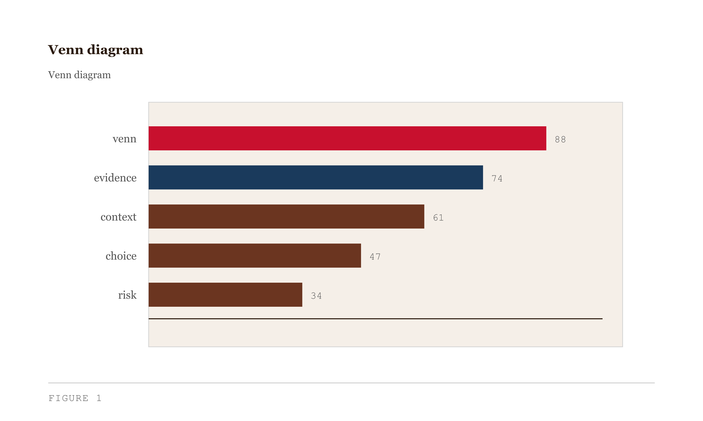
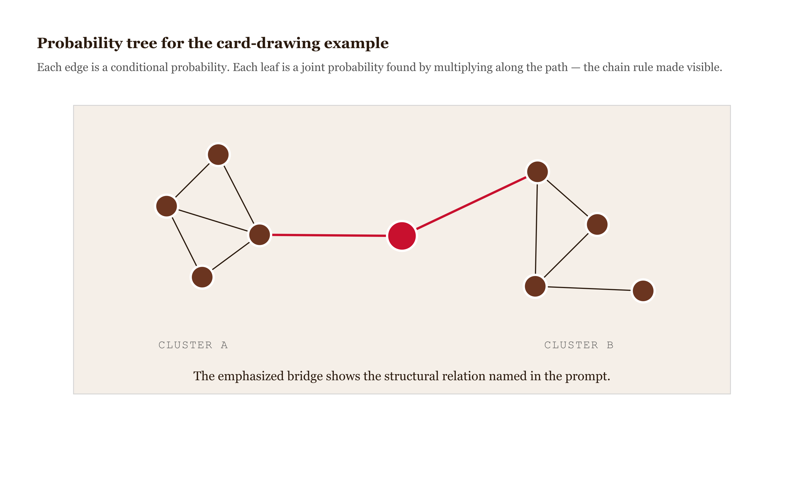
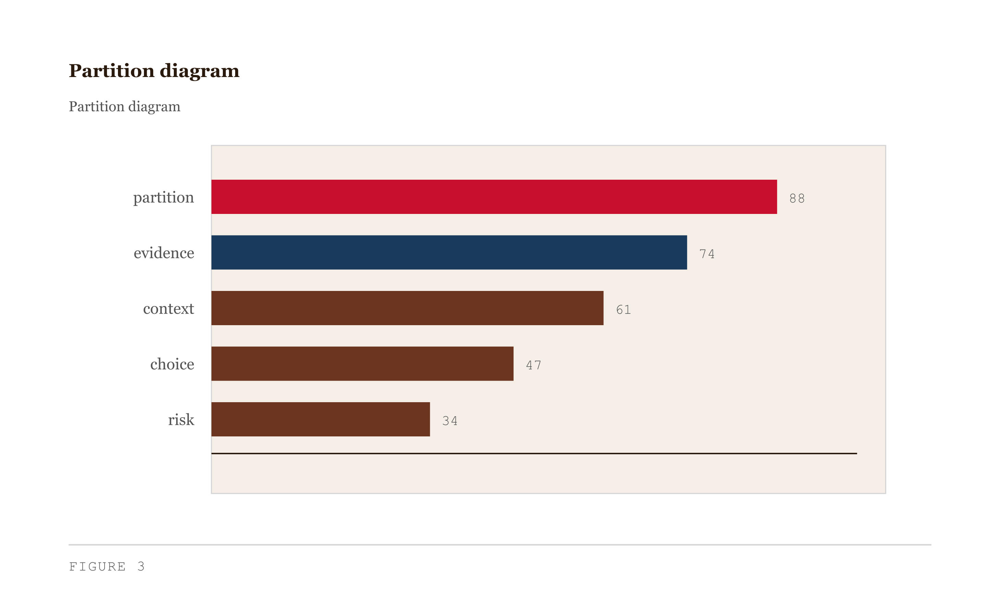
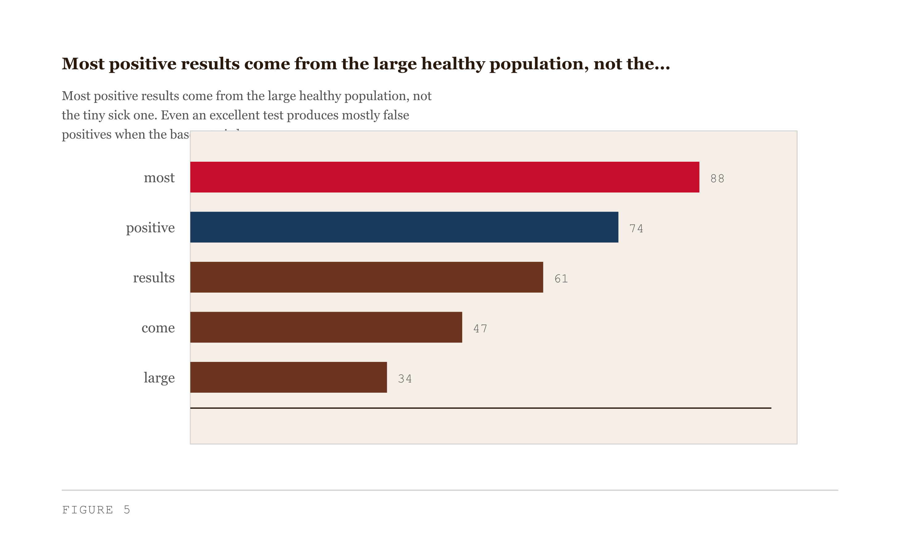
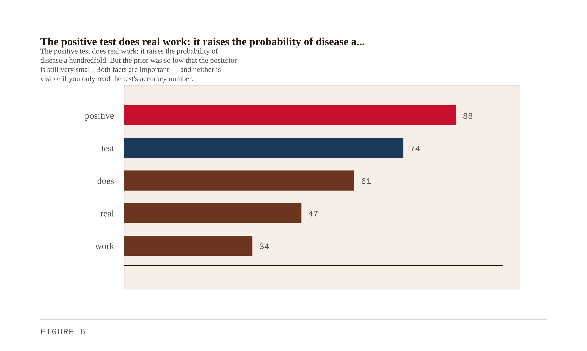
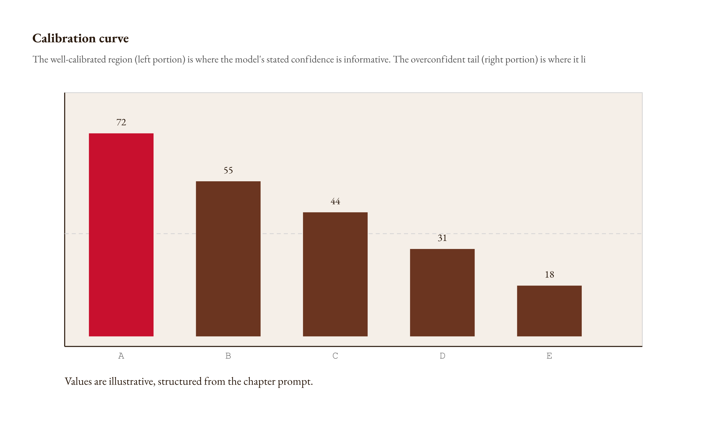
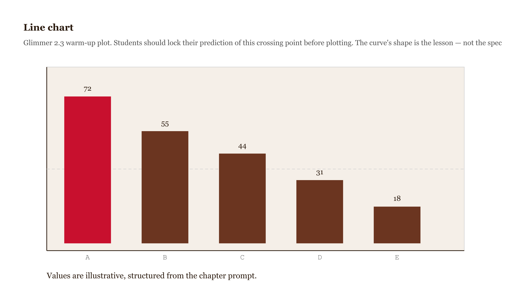
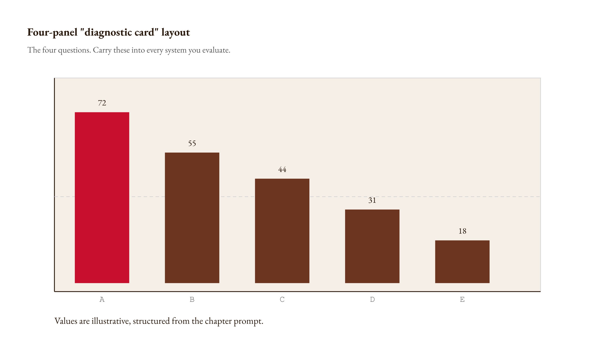

<!-- CHAPTERIZED 2026-07-02: TL;DR removed, exercises merged, bridges/prereqs updated to 13-chapter order. Rough draft for hand-rewrite; [verify]/[verify-xref] flags preserved. -->
# Chapter 2 — Probability, Uncertainty, and the Confidence Illusion

*Why your intuition forgets the prior, and what to do when it does.*

---

I asked a classifier to score a batch of records for me last week, and it handed back a column of probabilities. 0.94. 0.91. 0.88. Clean, sorted, ready to drop into a dashboard. It looked done. Here is what is actually happening: that column is a set of *degrees of belief the model holds*, formatted to look like *facts about the world*. The 0.94 does not announce whether 94 out of every 100 cases scored 0.94 actually turn out positive. It does not announce the base rate of the thing I am looking for. It does not announce whether the model was trained in a way that rewards saying 0.94 when it means 0.85. It just sits there, looking like a measurement.

That gap — between the confidence a system radiates and the confidence it has earned — is what this chapter is really about, and it is exactly where the pairing Chapter 1 committed us to does its work: the machine's speed, your doubt. The most pervasive failure in AI deployment is not that models are stupid. It is that confident numbers are not correct numbers, and almost nobody checks. The supervisory capacity this chapter trains hardest is **plausibility auditing** — the first of the five from Chapter 1, the capacity to hear the wrong note in a number *before* you can prove it wrong. And the wrong note here is almost always the same note: the model forgot the prior, or you did, or nobody checked whether 0.94 means what it says.

---

## Why this chapter

The failures we examined in Chapter 1 were not, for the most part, failures of model competence. The models were doing what their training permitted. The failures were failures of interpretation — of engineers and operators reading model outputs through intuitions that were not built for the problem at hand.

This chapter builds the apparatus for repairing those intuitions. We start from first principles: what probability actually is, and why the Boolean instinct — the one that got you this far in engineering — misleads you once you are working from a model rather than from the world directly. We do one calculation that will restructure how you read any uncertain output. We open one diagnostic that tells you whether a model's numbers mean what they appear to mean. We point at one structural worry that breaks every classical tool you have. We use all three on every subsequent chapter. And at the chapter's end you will do two things with the ideas, not one: **build** a pipeline that emits and calibrates its own confidence, and **audit** someone else's confident number against the base rate.

So here is what you should be able to do by the end. You should be able to apply Bayes' theorem to calculate the actual probability of a rare event given a positive test result — and explain why that answer differs from naive intuition; to use the total probability theorem to decompose a complex probability calculation into tractable pieces, and the multiplication (chain) rule to compute joint probabilities across sequential events; and to identify the base rate in a deployment scenario and explain how ignoring it produces systematically wrong conclusions. You should be able to distinguish between model accuracy and model calibration, and describe what a calibration curve reveals that accuracy metrics hide. And you should be able to recognize the conditions under which the Central Limit Theorem does not apply, identify when a deployment's loss distribution is likely to be heavy-tailed, and explain distribution shift as an instance of Hume's problem of induction — naming at least two mechanisms by which a model can become confidently wrong after deployment.

**Prerequisites.** Chapter 1 (AI systems and supervisory capacities). Familiarity with basic probability notation is helpful but not required — the notation is introduced from scratch. No calculus. Arithmetic and patience are the only tools you need for the calculations.

---

## What probability actually is — and why two engineers can disagree without either being wrong

Most of you came up through a Boolean education. A bit is one or zero. A program either runs or doesn't. A test passes or fails. A theorem is proved or it isn't. Even when you allow uncertainty in — error bars, tolerances, noise floors — it tends to come in as a small wobble around an essentially yes-or-no answer.

Probability is a different animal. The output is not "true" or "false." The output is a degree of belief — a number between zero and one that tells you how confident you should be, given what you currently know.

Here is the thing that takes some adjustment. Two engineers can look at exactly the same evidence, end up at different probabilities, and both be reasoning correctly. Not both be right in some mushy relativistic way. Correctly. The reason is that they walked in with different priors — different starting beliefs about the world before the evidence arrived. Probability is always conditional on your information state, and different people have different information states.

This bothers some people deeply. It should bother you a little, because it is a real shift. The Boolean instinct works fine in deterministic systems. It misleads you in any system where you are working from a model rather than from the world itself — and every machine learning system, every AI deployment, every statistical inference, is a model rather than the world.

### The three axioms

Before we go further, we need the formal scaffolding. It is light and you will use it constantly.

A **sample space** $\Omega$ is the set of all possible outcomes of an experiment. Rolling a die: $\Omega = \{1, 2, 3, 4, 5, 6\}$. Whether a patient has a disease: $\Omega = \{\text{sick}, \text{healthy}\}$.

An **event** is any subset of the sample space — any collection of outcomes we might care about. "The die shows an even number" is the event $\{2, 4, 6\}$.

A **probability measure** $P$ assigns a number to every event. To be a legitimate probability measure, $P$ must satisfy three axioms:

1. **Nonnegativity**: $P(A) \geq 0$ for every event $A$.
2. **Normalization**: $P(\Omega) = 1$. Something has to happen.
3. **Additivity**: If $A$ and $B$ are disjoint — they cannot both occur — then $P(A \cup B) = P(A) + P(B)$.

That is the entire foundation. Everything else — conditional probability, Bayes' theorem, the central limit theorem — is derived from these three rules. When you forget why some formula is true, come back here.

Two useful consequences follow immediately. First, $P(\emptyset) = 0$: the probability of nothing happening is zero. Second, $P(A^c) = 1 - P(A)$: the probability of $A$ not happening is one minus the probability of it happening.

| Axiom | Formal Statement | Plain English Meaning |
|---|---|---|
| **Nonnegativity** | $P(A) \geq 0$ | Probabilities are never negative. |
| **Normalization** | $P(\Omega) = 1$ | Something must happen — the total is always 1. |
| **Additivity** | $P(A \cup B) = P(A) + P(B)$ for disjoint $A, B$ | Probabilities of mutually exclusive outcomes add directly. |

*Every probability calculation in this book is a consequence of these three rules.*

### Classical and frequentist probability

There are two natural ways to assign those numbers, and you have probably used both without thinking about which you were using.

**Classical probability** applies when all outcomes are equally likely. You have a fair coin. The probability of heads is one divided by two — one favorable outcome out of two equally possible outcomes. This is the Laplace formula: $P(A) = \frac{\text{number of outcomes in } A}{\text{total number of outcomes}}$.

A bag contains one blue ball, one green ball, one red ball, one yellow ball, and one black ball. I draw without looking. The probability I draw yellow is $\frac{1}{5}$. Classical probability.

**Frequentist (relative-frequency) probability** applies to repeatable experiments. You toss a coin twenty times and get seven heads. The relative frequency of heads is $\frac{7}{20}$. As you run the experiment more and more times, this relative frequency converges — provided the underlying process is stable — to a limiting value we call the probability:

$$P(A) = \lim_{N \to \infty} \frac{\text{number of times } A \text{ occurred}}{N}$$

Frequentist probability is the natural language of quality control, A/B testing, and hypothesis tests on large samples. It is very good at telling you about stable, repeatable processes.

Neither interpretation, by itself, handles the question a deployed AI system routinely faces: *given this specific output right now, how should my belief about this specific case update?* For that, you need the third interpretation.

**Bayesian probability** treats probability as a degree of belief updated by evidence. You start with a prior belief — how likely something was before you saw the evidence. You observe evidence. You update. The posterior is what you should believe now. This is natural for one-off events: whether this specific transaction is fraud, whether this specific patient has a rare disease, whether this specific agent completed its task correctly.

For AI deployment, you will use all three. Use whichever fits the question. Do not get tribal about it.

| Interpretation | Best suited for | Key limitation |
|---|---|---|
| **Classical** | Equally-likely discrete outcomes (dice, cards, fair coins) | Requires symmetry; fails when outcomes aren't equally likely |
| **Frequentist** | Stable repeatable processes, A/B tests, quality control | Cannot assign probability to one-off events or unknown priors |
| **Bayesian** | One-off decisions, belief updating, AI deployment inference | Requires specifying a prior; result depends on that choice |

---

## Conditional probability — the probability that updates on what you know

Here is the engine. Almost every calculation in this chapter, and most of the calculations in this book, is a conditional probability.

Conditional probability gives you a way to reason about outcomes when you already have partial information. You know the test came back positive. You know the transaction is over a thousand dollars. You know the image contains a shadow at the lower left. Given that partial information, how likely is the event you care about?

The formal definition: the conditional probability of event $A$ given event $B$ — written $P(A \mid B)$, read "probability of $A$ given $B$" — is

$$P(A \mid B) = \frac{P(A \cap B)}{P(B)}$$

provided $P(B) > 0$. The numerator is the probability that both $A$ and $B$ occur. The denominator is the total probability of $B$. Dividing one by the other gives you the fraction of $B$'s probability that falls inside $A$.

There is a helpful picture here. Conditioning on $B$ is like shrinking the sample space. Once you know $B$ happened, only outcomes inside $B$ are still possible. Among those outcomes, $P(A \mid B)$ asks: what fraction of them are also in $A$?


*Figure 2.1 — Venn diagram *

And this is why it is the engine. When an agent reports "task complete," you do not want the raw probability that any such report is true. You want the probability that *this* report is true *given* what you know — that the task was novel, that the tool has failed before, that the environment was one the agent had never touched. Conditioning is the mathematics of "given what I already know," and every audit in this book is a conditional probability wearing a different costume.

An illustration to fix the formula. Say I have logged how a triage-support model behaves on the cases crossing its desk. Let $A$ = the case is genuinely high-acuity, $B$ = the case arrives with an abnormal lab flag already attached. From the log: 76% carry the flag, 45% turn out high-acuity, 30% are both. A flagged case arrives — how likely is it to be genuinely high-acuity?

$$P(A \mid B) = \frac{P(A \cap B)}{P(B)} = \frac{0.30}{0.76} \approx 0.395$$

About 39.5% — *lower* than the unconditional 45%. Seeing the flag did not raise my estimate, it lowered it, because the flag is common and most flagged cases are not serious. That is the shape of the trap this whole chapter circles: a salient signal arrives, intuition reads it as bad news, and the conditioning says otherwise. The formula does the work the intuition won't.

One property to carry forward: $P(\cdot \mid B)$ is itself a legitimate probability measure on the shrunken sample space $B$ — it obeys all three axioms. Adding disjoint events, taking complements: all of it works unchanged once you condition. You have not learned a new tool, only moved into a smaller world.

---

## The multiplication rule — building joint probabilities from conditionals

Rearranging the conditional probability definition gives us something immediately useful. If

$$P(A \mid B) = \frac{P(A \cap B)}{P(B)}$$

then

$$P(A \cap B) = P(B) \cdot P(A \mid B)$$

This is the **multiplication rule**: to find the probability that both events occur, multiply the probability of the first by the conditional probability of the second given the first. It sounds simple. The power is in how it extends.

For three events:

$$P(A_1 \cap A_2 \cap A_3) = P(A_1) \cdot P(A_2 \mid A_1) \cdot P(A_3 \mid A_1 \cap A_2)$$

For $n$ events — the **chain rule**:

$$P\left(\bigcap_{i=1}^n A_i\right) = P(A_1) \cdot P(A_2 \mid A_1) \cdot P(A_3 \mid A_1 \cap A_2) \cdots P\left(A_n \mid \bigcap_{i=1}^{n-1} A_i\right)$$

This is the machinery for reasoning about anything sequential — which is to say, for reasoning about an agent. An agent that reports "task complete" almost never did one thing. It chained tool calls: read a file, call an API, write a result, verify. The report is a claim about the *whole chain* succeeding, and the chain rule is how you take that claim apart.

### Worked example — an agent's tool-call chain

An illustration, with numbers invented to keep the arithmetic clean. An agent must land three tool calls in order, and all three have to succeed for the task to actually be done. Let $A_i$ = step $i$ succeeds. The first call goes into a fresh, known environment, so it is reliable: $P(A_1) = 0.9$.

But the calls are *not* independent, and that is the point. Once the first call succeeds, the agent is operating on the state that call produced — less certain than the one it started from — so the second call, given the first, is a little less reliable, and the third, given the first two, less reliable again:

$$P(A_2 \mid A_1) = 0.85, \qquad P(A_3 \mid A_1 \cap A_2) = 0.8$$

The chain rule gives the probability the whole task actually completed:

$$P(A_1 \cap A_2 \cap A_3) = 0.9 \cdot 0.85 \cdot 0.8 = 0.612$$

About 61% — against a single, clean "task complete." The report is one bit; the thing it claims is a product of three shrinking conditionals.


*Figure 2.2 — Probability tree for the agent tool-call chain*

Now the mistake almost everyone makes. Two events are **independent** when knowing one tells you nothing about the other — then $P(A \mid B) = P(A)$ and the rule collapses to $P(A \cap B) = P(A) \cdot P(B)$. Assume the three steps are independent and reliable at $0.9$ each, and you compute $0.9^3 = 0.729$: 73% where the honest number was 61%. Twelve points of unearned confidence, all of it from assuming away the dependence. In real agent runs independence fails *quietly* — one step's failure degrades the state the next depends on, so failures cluster instead of scattering — and the error runs in the optimistic direction. That is the direction that gets you hurt.

---

## The total probability theorem — decomposing complex problems

Here is the next tool. Sometimes you cannot compute $P(B)$ directly, but you can compute it by breaking the sample space into pieces.

Let $A_1, A_2, \ldots, A_n$ be events that partition the sample space: they are mutually exclusive (no two can occur simultaneously), collectively exhaustive (one of them must occur), and each has positive probability. Then for any event $B$:

$$P(B) = \sum_{i=1}^n P(A_i) \cdot P(B \mid A_i)$$

This is the **total probability theorem**. It says: if you can compute the probability of $B$ conditional on each possible "scenario" $A_i$, and you know how likely each scenario is, you can add them up — weighted by their probabilities — to get the unconditional probability of $B$.

The intuition: each $A_i$ is a different state the world could be in. $P(B \mid A_i)$ is how likely $B$ is if the world is in state $A_i$. $P(A_i)$ is how likely that state is. Summing across all states gives you $P(B)$.


*Figure 2.3 — Partition diagram *

### Worked example — the fleet's error rate

Here is where I need it. A fraud-screening pipeline routes its cases across three model versions still running in production — call them A, B, C, with numbers chosen to keep the arithmetic clean. Version A handles 40% of traffic, B 30%, C 30%; they are not equally good — A gets a case wrong 2% of the time, B 3%, C 5%. I want the pipeline's overall error rate, the fraction of *all* screened cases that come back wrong.

No single model reports that number. But I can partition. Let $D$ = the output is wrong, and let $A$, $B$, $C$ partition the cases by which version handled them:

$$P(D) = P(A) \cdot P(D \mid A) + P(B) \cdot P(D \mid B) + P(C) \cdot P(D \mid C)$$
$$= 0.40 \times 0.02 + 0.30 \times 0.03 + 0.30 \times 0.05 = 0.032$$

3.2% of outputs are wrong — a number that lives in none of the three models but falls straight out of the partition. That is the whole use of the theorem: when you cannot measure a system-level rate directly, decompose it into scenarios you *can* measure, weight each by how often it occurs, and sum. Hold onto this partition. In the Bayes section we run it backward — given that an output *was* wrong, which version most likely produced it? Not the one handling the most traffic.

---

## The test that is 99% accurate, and the patient it kills

Now I want to tell you about a test.

It is a screening test for some disease — pick whichever one makes you uncomfortable. The disease is rare. About one person in ten thousand has it. The test is, the company says, ninety-nine percent accurate. A patient walks in, takes the test, and the test comes back positive.

Now: how confident are you that this patient has the disease?

Stop. Don't read on yet. Pick a number. Say it out loud if you have to. Lock it in. The whole point of what follows is wrecked if you peek without committing.

I have put this question to a lot of engineers, smart ones, and almost everybody answers somewhere above ninety percent. Some hedge — "maybe ninety-five." A few brave souls go to seventy. Almost nobody goes lower. The reasoning sounds airtight: the test is ninety-nine percent accurate, the test came back positive, therefore the patient probably has the disease. What could be more obvious? And this is not a failing of amateurs. It is exactly the result the classic study found: Casscells, Schoenberger, and Graboys put a 1-in-1,000 version of this question to sixty Harvard house officers, students, and attendings, and most answered around 95% — off by roughly the same two orders of magnitude I am about to walk you through (Casscells, Schoenberger, and Graboys, "Interpretation by Physicians of Clinical Laboratory Results," *New England Journal of Medicine* 299, no. 18, 1978).

The actual answer is about one percent.

I want to walk you through why, and I want to do it by counting bodies before any formula — then confirm it with the total probability theorem you just learned. Imagine ten thousand people taking the test. One of them, on average, actually has the disease — that is the base rate, one in ten thousand. The test, which is 99% accurate in the sense that it correctly identifies people who are sick, catches that person. Call it one true positive.

The other 9,999 do not have the disease. "Ninety-nine percent accurate" also means the test correctly returns negative on 99% of healthy people. The other 1% — that is 0.01 times 9,999, about 100 people — get a false positive.

So we have: one true positive, and about one hundred false positives. One hundred and one positive results in total. If you pull a positive result out of that pool, the chance it came from someone who is actually sick is $\frac{1}{101}$, about one percent.

A precision note, since this chapter's whole brand is precision about numbers: "99% accurate" is doing double duty above. I used it as both the true-positive rate and the true-negative rate. Those are two different numbers — *sensitivity* and *specificity* — and a real test has two, not one. The loose shortcut is standard in textbooks, and I keep it here because it makes the counting clean, but I am flagging it because a sharp reader should catch a book that warns against decorative numbers using one of its own.


*Figure 2.5 — Population grid of 10,000 dots arranged as a*

Now, isn't that something? The test is doing exactly what its specification said it would do. The number on the box is honest. Nothing is broken. And yet your intuition was off by two orders of magnitude.

What went wrong? You were computing the right answer to a different question. You were computing *given the disease, how often does the test get it right?* That is ninety-nine percent. But the question you needed was *given a positive test, how often is the disease there?* Those are not the same question. You cannot get from one to the other without one extra ingredient: the prior probability of disease in the population — the base rate.

Your intuition forgot the prior. Almost all intuition, in my experience, forgets the prior. We are built to judge evidence by its own face value, not by adjusting it against the background rate of what we are looking for. In a world where diseases were common, that intuition would serve us better. In a world of rare events and large-scale automated detection systems, it kills us.

This is the plausibility-auditing muscle in its purest form: the audit on a confident number *is* the base-rate check. Before you trust a flag, ask what fraction of the flagged population is actually real. It is also a Humean point wearing engineering clothes — the confident number is a claim about the future dressed up as a fact about the present, and the base rate is the piece of the past you needed to weigh it. You will do this move by reflex by the end of the book.

---

## Bayes' theorem — the bookkeeping made explicit

The calculation we just did has a name and a formula. Let me write it down, because the formula makes explicit where the prior lives.

Let $A_1, A_2, \ldots, A_n$ partition the sample space, and let $B$ be any event with $P(B) > 0$. Then:

$$P(A_i \mid B) = \frac{P(A_i) \cdot P(B \mid A_i)}{P(B)} = \frac{P(A_i) \cdot P(B \mid A_i)}{\sum_{k=1}^n P(A_k) \cdot P(B \mid A_k)}$$

The denominator is the total probability theorem from the previous section. Bayes' theorem and the total probability theorem are the same piece of machinery, deployed in opposite directions.

For our disease example: $A_1$ = disease present, $A_2$ = disease absent, $B$ = positive test.

$$P(\text{disease} \mid \text{positive}) = \frac{P(\text{disease}) \cdot P(\text{positive} \mid \text{disease})}{P(\text{positive})}$$

$$= \frac{0.0001 \times 0.99}{0.0001 \times 0.99 + 0.9999 \times 0.01} \approx \frac{0.000099}{0.010098} \approx 0.0098$$

About one percent. Same answer as before.

| Term | Plain English Name | Value in the Disease Example | Role in the Formula |
|---|---|---|---|
| $P(\text{positive} \mid \text{disease})$ | Sensitivity / true positive rate | 0.99 | Numerator factor: how strongly the evidence supports the hypothesis |
| $P(\text{disease})$ | Base rate / prior | 0.0001 | Numerator factor: what we believed before seeing the evidence |
| $P(\text{disease} \mid \text{positive})$ | Posterior | ≈ 0.0099 | What we actually want — belief after the evidence |
| $P(\text{positive})$ | Total positive rate | ≈ 0.0101 | Denominator: normalizes so probabilities sum to 1 |

*The prior sits in the numerator with the same weight as the test's sensitivity. Drop it and you have thrown away half the equation.*

The thing the formula makes unmissable is this: the posterior — what you believe after seeing the evidence — is proportional to the prior times the likelihood. The prior is in the numerator, with the same weight as the quality of the evidence. You cannot legitimately ignore it.

### The inference interpretation

There is a beautiful way to read Bayes' theorem that matters enormously for AI deployment. Think of $A_1, A_2, \ldots, A_n$ not as events but as hypotheses — possible states the world could be in. $B$ is the evidence you observe. $P(A_i)$ is your prior: how probable you thought hypothesis $i$ was before seeing the evidence. $P(B \mid A_i)$ is the likelihood: how probable the evidence would be if hypothesis $i$ were true.

Bayes' theorem tells you exactly how to update your prior into a posterior. This is formal belief revision. The formula prevents both overcounting evidence (acting as though a positive test proves disease) and undercounting prior beliefs (acting as though the test's accuracy is all that matters).


*Figure 2.6 — Before/after bar chart pair*

### Worked example — factory revisited

From the manufacturing example above: a defective item is sampled. What is the probability it came from machine C?

Using Bayes' theorem:

$$P(C \mid D) = \frac{P(C) \cdot P(D \mid C)}{P(D)} = \frac{0.30 \times 0.05}{0.032} = \frac{0.015}{0.032} \approx 0.469$$

Even though machine C produces only 30% of all items, it produces almost 47% of the defectives — because its defect rate is the highest. This is the kind of inference Bayes enables: reasoning backward from evidence to cause.

Similarly: $P(A \mid D) = \frac{0.008}{0.032} = 0.25$ and $P(B \mid D) = \frac{0.009}{0.032} \approx 0.28$.

A concrete quality-control conclusion: if you observe a defect, the most likely culprit is machine C, even though it is not the largest producer.

| Machine | Share of total output | Defect rate | Share of defectives (posterior) |
|---|---|---|---|
| **Machine A** | 40% | 2% | 25% |
| **Machine B** | 30% | 3% | 28% |
| **Machine C** | 30% | 5% | 47% |

*The machine that produces the most defectives is not the largest machine — it's the one with the highest defect rate. Bayes makes this visible.*

### The false-positive structure is everywhere

This is not a parlor trick. The structure turns up in every domain where the thing you are looking for is rare.

Fraud detection: most transactions are legitimate. Security alerts: most logins are not attackers. Medical screening: most patients do not have the rare condition. Content moderation: most posts are not harmful. Agentic-system jailbreaks: most user inputs are not trying to break the model.

Whenever the positive class is rare, even an excellent detector produces mostly false alarms. The math is structural — no amount of engineering can escape it without raising the base rate itself (screen higher-risk populations) or accepting lower sensitivity (miss more true positives to reduce false positives).

What happens in practice when you build a system like this and deploy it? The analysts or on-call engineers get a flood of alarms. They check the first few. False. They check the next few. False again. Within a week or two they learn, in their bones, that the alarms do not mean anything. They start ignoring them. They miss the real one when it comes. Not because they are careless. Because the system's signal-to-noise ratio was too low, by a structural mathematical fact that nobody warned them about during design.

The Epic Sepsis Model from Chapter 1 is this structure caught in the act: an external validation found it flagged a large fraction of hospitalized patients as at-risk while sepsis is far rarer than the alert rate, so most of those alerts were false — exactly the base-rate arithmetic above, at hospital scale, generating the alert fatigue clinicians reported. [verify: confirm the specific alert-rate and sensitivity figures and the Wong et al. 2021 *JAMA Internal Medicine* external-validation citation before publication.]

This is why we started with base rates. Not because the math is hard. Because forgetting the prior is the single most common mistake in interpreting probabilistic system outputs, and the consequences are not theoretical.

| Domain | What is rare | Typical base rate | Consequence of ignoring the prior |
|---|---|---|---|
| **Fraud detection** | Fraudulent transactions | ~0.1–1% | Analyst alert fatigue; real fraud ignored |
| **Security monitoring** | Malicious logins | ~0.01–0.1% | Teams disable or ignore automated alerts |
| **Medical screening** | Target disease (rare condition) | ~0.01–1% | Unnecessary downstream procedures, patient harm |
| **Content moderation** | Genuinely harmful posts | ~0.01–0.1% | Moderation teams overwhelmed with false positives |
| **AI jailbreak detection** | Adversarial inputs | ~0.001–0.01% | High false-positive load undermines trust in the detector |

*The structure is the same in every row. The math does not care about the domain.*

---

## From Boolean to probabilistic — and why the move is harder than it looks

The calculation above does more than give you a number. It requires a full shift in how you think about outputs.

In deterministic systems, the output is a fact. "The function returned 42" is true or false, verifiable, final. In probabilistic systems, the output is a degree of belief. "The model returned 0.91" is not a fact about the world — it is a probabilistic claim conditional on the model's parameters, training data, and implicit assumptions about the deployment environment.

This matters when you chain probabilistic inferences. Consider an AI triage system that flags a patient as high-acuity with probability 0.87. What does that number mean? It means: conditional on the model's training distribution being similar to this patient, and conditional on the model's calibration being good, and conditional on no distribution shift having occurred, the model predicts this patient is similar to the high-acuity cases in training. Remove any one of those conditions, and the 0.87 means something else — or nothing.

The move I need you to make — and you will make it over and over for the rest of this book — is this: every model output is a probabilistic claim, and every decision based on a model output is a decision under uncertainty. The output is not a number. It is a probabilistic claim about what kind of input is in front of you, conditional on the model's implicit beliefs about the world.

When you make this move, a lot of the rest of the book becomes clearer.

---

## Hume's induction problem, re-translated as distribution shift

There is a problem from philosophy you have to know about, because it shows up, in disguise, in every deployed system.

David Hume, in the eighteenth century, asked an awkward question. You have watched the sun come up every morning of your life. So has everyone you know. So has every record-keeper in human history. Does any of that *guarantee* the sun will come up tomorrow? Hume's answer, which infuriated people: no. Logically, the future is free to differ from the past. Induction works because the world cooperates, not because the laws of logic force it to.

Engineers translate this into our own language. The training set is the past. The deployment is the future. **Distribution shift** is the technical name for the world declining to cooperate.

Every machine learning deployment is a bet that the world you operate in looks enough like the world you trained on that the patterns you learned still apply. Sometimes the bet pays off and pays off for years. Sometimes the world quietly changes — the inputs drift, the base rates move, the relationship between cause and effect mutates — and the model keeps producing confident outputs that have come unstuck from reality. The model does not know. It cannot know. Its confidence is calculated under the assumption that the world is the world it learned.

There is a documented case from the early pandemic. Models trained on pre-2020 medical imaging were deployed in 2021. The imaging signatures had been altered by COVID's effect on the lungs and on the population that ended up in scanners. The models produced confident predictions that no longer matched the underlying disease distribution. [Verify: DeGrave et al. 2021, *Nature Machine Intelligence* — confirm specific citation and scope before publication.]


*Figure 2.7 — Two overlapping bell curves on a shared x-axis*
You will not, in general, be able to detect this kind of drift just by watching the model's outputs. The model continues to look confident through the shift; the shape of its outputs stays similar; the dashboards stay green. Detection requires watching the inputs, watching the outputs, and — most of all — watching the actual outcomes the model was supposed to predict, when those outcomes eventually become observable. Most deployments do not budget for that. Most find out about distribution shift through the harm.

Hume on the page, in our register: the model's track record tells you about the past. The honest question is *what would have to remain true about the deployment for the track record to keep being informative?* If you cannot answer that, you do not actually trust the track record. You just have not noticed yet.

---

## Calibration — the most operationally important diagnostic in this chapter

I want to spend time on a specific, operational idea — the most useful diagnostic in this chapter. It is called *calibration*, and a model can be very accurate without being calibrated, and the difference matters.

A model is calibrated when its stated probabilities match what actually happens. If the model says "seventy percent confident" on a thousand cases, you want roughly seven hundred of those cases to turn out positive. If only four hundred do, the model is overconfident — its stated number is bigger than it has any right to be. If nine hundred do, the model is underconfident.

You can see this in a picture. Put the model's stated probability on the horizontal axis. Put the actual frequency of positives on the vertical axis. A perfectly calibrated model traces the diagonal — where stated and actual are equal. A miscalibrated model peels off the diagonal, and the *shape* of how it peels off tells you something about how the model is wrong.


*Figure 2.8 — Calibration curve *

Here is a pattern that turns up everywhere in modern deep learning, and it is not an accident of one bad model. The model is reasonably calibrated in the middle of its range — when it says "sixty percent" it is about right. But at the extremes, especially toward the high end, it is badly overconfident. It says "ninety-nine percent" when it should be saying "eighty-five." The mathematics of how these models are trained — deep architectures, the softmax with cross-entropy loss, the tricks that improve raw accuracy — actively rewards extreme confidence even when the underlying decision is not really that confident. A net will say "99%" when it should say "85%," and it will say it fluently.

Guo, Pleiss, Sun, and Weinberger documented this precisely, and — this is the part worth internalizing — they also showed a cheap fix: **temperature scaling**. You take a single learned parameter $T$ and divide the pre-softmax logits $z$ by it before the softmax,

$$\text{softmax}(z / T)$$

with $T > 1$ softening the distribution toward honesty. One parameter, fit on a held-out set, and much of the overconfidence disappears (Guo, Pleiss, Sun, and Weinberger, "On Calibration of Modern Neural Networks," ICML 2017, arXiv:1706.04599). Why does something that simple work? Because the model's *ranking* of cases was usually fine; only the *stated confidence* was inflated. Temperature scaling fixes the number without touching the decision — which is direct evidence that the confidence and the correctness were separable all along. The number was decorative; temperature scaling is how you un-decorate it.

I am not going to sell temperature scaling as free, because that would be exactly the kind of decorative claim this chapter warns against. It fixes *average* calibration on the distribution you fit it to. It does nothing for distribution shift — if the deployment world drifts from the calibration set, the honest number goes stale, and it goes stale silently. This works if you value honest confidence on in-distribution data; it fails when you need honest confidence on the tail, on the novel case, on the day the world moves. Which, of course, is precisely the day you most needed it. That trade-off — honesty bought cheaply on the data you have, at the price of silence on the data you do not — is the shape of nearly every calibration fix.

Here is the move I want you to internalize, and it is a Popperian one: *do not trust a model's stated probability without seeing its calibration curve on data drawn from the actual deployment distribution.* State the condition under which you would *reject* the number, then go look. The four diagnostic questions at the end of this chapter are falsification conditions in disguise. Without that prior specification you are reading the score with no criterion except how confident it sounds — and how confident it sounds is exactly the fluency trap from Chapter 1, now operating on a number instead of a sentence. The number on the screen, by itself, is decorative. It might mean what you think it means; it might be off by a lot; you have no way of telling without checking.

And calibration is not just a property of models. It is a property of forecasters in general — of *you*. If you sit down and write ninety-percent confidence intervals for a stack of forecasting questions, then later check how many of those intervals actually contained the truth, you will almost certainly discover that your intervals contained the answer about half the time, not nine times out of ten. Most people, including most very smart people, walk around significantly overconfident in their own beliefs, and they do not know it because nobody runs the experiment. That is the plausibility audit turned on yourself — the same base-rate discipline you apply to a vendor's number, applied to your own. Run the experiment. The calibration baseline at the end of this chapter is not optional.

### Glimmer 2.4 — Calibration curves you can trust and ones you cannot (BUILD)

This is a **build** exercise: you make a pipeline emit its own confidence, calibrate it, and catch the decorative number before it catches you.

1. Take a publicly available pretrained classifier — a sentiment classifier, an image classifier, anything with a confidence output. *Emit*: run it on a held-out dataset with ground-truth labels and capture the stated confidence on every case.
2. *Lock your prediction before plotting*: do you expect the curve to track the diagonal, sag below it, or rise above it? Where on the x-axis do you expect the curve to peel off? Write it down; you cannot revise it.
3. Bin the model's predictions by stated confidence (0.0–0.1, 0.1–0.2, …, 0.9–1.0).
4. For each bin, compute the empirical accuracy. Plot stated versus actual against the diagonal.
5. Compare your prediction to what you see.
6. *Calibrate*: fit temperature scaling — one parameter $T$ on the held-out logits — and re-plot. Note what moved and what did not. The ranking of cases should not change; only the confidence should.
7. *Name your decorative number*: point at one confidence score your pipeline emitted that you were about to trust, and say — with the curve as evidence — how far off it was and why you almost believed it.
8. Now change the held-out set to one drawn from a slightly different distribution (different domain, different time period, different demographic skew). Re-plot. Predict where the calibration breaks — including whether your fitted $T$ still helps.

The deliverable is the two (or three) plots, your locked prediction, the fitted $T$, the one-sentence confession about the decorative number, and the gap analysis between your predictions and the curves. The first plot teaches calibration. The temperature-scaling step teaches that confidence and correctness were separable all along. The last plot teaches distribution shift — and that a calibration fixed in-distribution goes stale silently out of it. The gap between what you predicted and what you got is the learning event.

---

## When the Central Limit Theorem politely declines to help

There is one more thing, because it is the place where standard-issue probability training will betray you.

If you have taken a stats class, you have met the Central Limit Theorem. It says, more or less, that if you add up a lot of independent random variables with finite variance and normalize them, the result looks like a Gaussian — the bell curve. This is a beautiful theorem and it is the reason averages are useful, confidence intervals work, and quality control exists as a discipline.

The theorem has two requirements buried in it. *Independent.* And *finite variance.*

When either requirement fails, the theorem fails, and the failure is usually quiet. **Independence** breaks down in network-structured data, in time series with autocorrelation, in any system where one event's outcome shifts the probability of subsequent events. **Finite variance** breaks down in heavy-tailed distributions — distributions where extreme events are not rare enough for averaging to dampen them.

Power-law distributions are common in real systems: wealth, file sizes, network connection counts, earthquake magnitudes, training-loss spikes during model fitting, and the cost of a deployed AI system being wrong about a single decision.


*Figure 2.9 — Two distributions overlaid on the same x-axis*

In a heavy-tailed regime, the sample mean does not settle down as you collect more data. You compute the average of a thousand observations and the next observation moves the average by a lot. Confidence intervals computed under Gaussian assumptions are nonsense here — but they look exactly like normal confidence intervals, so you have to know to be suspicious.

For deployment, the question that matters is: what is the distribution of the *cost* of being wrong? If most of your wrong outputs are minor inconveniences but one in a thousand kills a patient or wipes a database — your loss distribution is heavy-tailed, and a deployment evaluated on average loss is being evaluated on a quantity that does not converge in any useful sense. You need tail-aware metrics. You need worst-case analysis. You need to design adversarial inputs deliberately, so the rare catastrophes show up in testing instead of in production.

Which brings us back, by a winding road, to the triage system from the last chapter. That system was operating in a heavy-tailed loss world. Most of its low-acuity classifications were correct or close to correct. A few were catastrophic. The average loss across deployments was tiny. The catastrophic loss was the only one that mattered. The system had been validated on average-loss metrics, and the validation came back beautiful. The validation was also irrelevant to the question that should have been asked.

Hume on the page, one more time: the past is informative about the past. The next observation can break your average. Plan accordingly.

### The other Glimmers in this chapter

**Glimmer 2.1 — The convergence that always happens until it doesn't.** Run a Monte Carlo simulation of sample means from a Gaussian. Watch the convergence. Then run the same simulation from a Cauchy distribution. Lock your prediction of where the Cauchy mean settles. Watch it not settle. Explain why — and write one sentence about which deployed systems might have Cauchy-like loss distributions.

**Glimmer 2.2 — The Cauchy break.** Take any analysis tool from your course's quantitative apparatus that assumes finite variance. Apply it to Cauchy-distributed data. Predict, before running, what kind of nonsense it will produce. Compare your prediction to the actual nonsense.

**Glimmer 2.3 — The 99% accurate test.** Take the disease example from this chapter. Vary the base rate from 1/100 to 1/100,000. Plot positive predictive value as a function of base rate. Predict, before plotting, where the curve goes through 50%. Identify, from a current AI deployment in your field, which base rate regime you are in.


*Figure 2.10 — Line chart *

---

## The calibration baseline

*This exercise returns in Chapters 4 and 13.*

You are given a set of forecasting questions across several domains — some technical, some general. For each question, provide a 90% confidence interval for the answer. After the truth is revealed, compute the fraction of your intervals that contained the true value.

If you are well-calibrated at 90%, that fraction should be 0.9. Most engineers, on first attempt, score between 0.4 and 0.6 — meaning their 90% intervals contained the answer about half the time. They were operating as though they were two to three times more sure of themselves than the evidence warranted.

This number is uncomfortable. The discomfort is the point. We will return to it in Chapter 4, once the robustness material has done its work, and in Chapter 13, at the end.

---

## Synthesis — four questions that prevent most deployment disasters

Most of the failures of confidence in deployed AI systems are not failures of model competence. The models are doing what their architectures and training data permit them to do. The failures are failures of *interpretation* — of humans reading model outputs through intuitions not built for the problem at hand. The intuition forgets the prior. The intuition trusts the stated number. The intuition averages over a heavy-tailed loss. The intuition assumes the deployment world is the training world.

The technical content of this chapter — conditional probability, the chain rule, the total probability theorem, Bayes, calibration, heavy tails — is the apparatus for repairing those intuitions. Not replacing them; you cannot run on equations alone in a noisy room. But the apparatus is what you reach for when the intuition starts to feel too confident.

Four questions, in order:

1. **What is the base rate?** Before the model saw this case, how likely was the positive class in this population?
2. **Is the model calibrated?** Does its stated confidence match empirical frequencies on data drawn from this deployment distribution?
3. **What is the cost distribution?** Is the loss of being wrong roughly uniform, or are there rare catastrophic outcomes that average-loss metrics will miss?
4. **What changed since training?** What would have to remain true about the deployment distribution for the training-era track record to remain informative?

These four questions, asked in the right order, would have prevented most of the deployment disasters I have watched unfold. We use all four on every system we analyze in the remaining chapters.


*Figure 2.11 — Four-panel "diagnostic card" layout *

---

## What would change my mind

If a deployment-monitoring methodology emerged that reliably detected distribution shift in production from output statistics alone — without access to ground-truth outcomes — the calibration framing in this chapter would need revision. Current methods detect a subset of shifts; the general problem is open. [Verify: Krell et al. 2024 on out-of-distribution detection — confirm citation before publication.]

I do not have a clean diagnostic for when a deployment's loss distribution is heavy-tailed *before* the catastrophic event reveals it. Tail estimation from a sample is mathematically impolite. The honest answer is: assume heavy tails when the cost-of-error includes harm to people, and engineer accordingly. That is a heuristic, not a calculation, and I have not solved this.

---

## Connections forward

A calibration curve tells you how confident the model should be. It does not tell you what the model is confident *about* — what it has noticed, what it has missed. The model's outputs are shaped by its training data, and the training data was shaped by choices — about what to record, what to include, how to join, where to stop — that are almost never written down.

That is Chapter 3. Before the model, there is data; before the data, there is the epistemic frame behind it, and the next chapter is about reconstructing that frame, starting with a question no histogram asks: *why are there exactly N rows?* Chapter 4 returns to calibration in the context of adversarial robustness — can a model be calibrated on clean inputs and wildly miscalibrated on perturbed ones? Chapter 6 returns from the other side to *who* made the choices behind the data — whose face the model works on and whose it does not. Chapter 13 closes the loop with the calibration baseline.

---

## Exercises

### Warm-up

**1.** A spam filter flags incoming email as spam or not-spam. The filter is 98% accurate (correctly identifies spam as spam and non-spam as non-spam). Your email server receives 10,000 emails per day; on average, 200 of them are actually spam. How many false positives should you expect per day? What fraction of flagged emails are false positives? *(Tests: base-rate reasoning, Bayes arithmetic)*

**2.** A model reports 0.91 probability on a classification. You have no calibration data. What can you legitimately conclude from this number, and what can you not conclude? Write a two-sentence answer. *(Tests: understanding of what calibration is and isn't)*

**3.** Write out Bayes' theorem from memory, label each term in plain English, and identify which term is the prior. Then write the total probability theorem and explain how the two formulas are related. *(Tests: mechanical retention and structural connection)*

**4.** A bag contains 3 red balls and 7 blue balls. Two balls are drawn without replacement. Use the chain rule to calculate the probability that both balls are red. Show each step. *(Tests: mechanical application of the multiplication rule)*

**5.** A fair coin is flipped three times. Let $A$ = "at least two heads" and $B$ = "the first flip was heads." Calculate $P(A \mid B)$ using the definition of conditional probability. *(Tests: conditional probability from first principles)*

### Application

**6.** A fraud-detection model is 97% accurate and flags 0.5% of all transactions as fraudulent. Actual fraud affects 0.1% of transactions. Using Bayes' theorem, calculate: of all flagged transactions, what fraction are genuinely fraudulent? Show your work and interpret the result in one sentence. *(Tests: applying Bayes to a real-world deployment scenario)*

**7.** A factory has two production lines. Line 1 produces 60% of output and has a 1% defect rate. Line 2 produces 40% of output and has a 4% defect rate. (a) Using the total probability theorem, calculate the overall defect rate. (b) A defective item is sampled. Using Bayes' theorem, calculate the probability it came from Line 2. Show your work. *(Tests: total probability theorem plus Bayesian inference together)*

**8.** You generate ninety-percent confidence intervals for twenty forecasting questions. Six months later, fourteen of the twenty intervals contained the actual answer. Are you overconfident, underconfident, or well-calibrated? How would you use this result to improve future forecasts? *(Tests: calibration concept applied to human forecasting)*

**9.** A medical imaging model was trained on data from 2018–2019 and deployed in 2022. Performance metrics from validation look excellent. Describe two specific mechanisms by which distribution shift could have degraded real-world performance without appearing in the model's stated confidence scores. *(Tests: distribution shift reasoning)*

**10.** A classification system for security alerts has an average false-positive rate of 2% and an average false-negative rate of 0.5%. The average cost of a false positive is $10 (analyst time). The cost of a false negative is $500,000 (breach). Explain why evaluating this system on average-loss metrics is misleading, and name the right framework to use instead. *(Tests: heavy-tailed loss reasoning)*

### Synthesis

**11.** You are asked to evaluate a new AI triage tool before deployment. The vendor presents an accuracy figure of 94% on a validation set. List the four questions from the synthesis section, and for each one, describe what information you would need from the vendor to answer it. *(Tests: integrating base rate, calibration, distribution shift, and loss-distribution thinking)*

**12.** A model's calibration curve shows that it is well-calibrated in the 0.4–0.6 confidence range but systematically overconfident above 0.85. Describe two deployment scenarios where this pattern is low-risk and two where it is dangerous. What does your answer reveal about why calibration alone is not sufficient for safe deployment? *(Tests: applying calibration insight to real design decisions)*

**13.** The chapter draws a structural analogy between Hume's problem of induction and machine learning deployment. Construct a parallel argument: take any ML system you are familiar with and describe (a) what "the past" consists of for that system, (b) what assumption about continuity is being made, and (c) one specific change in the world that would invalidate that assumption. *(Tests: transferring the induction framework to a new domain)*

**14.** In the fleet example from the total probability theorem section (above), suppose the traffic split shifts: version C — the least reliable, at a 5% error rate — is scaled up to handle 50% of cases, while A drops to 20% and B stays at 30%. Recompute the pipeline's overall error rate $P(D)$ with the total probability theorem. Then, using Bayes, recompute $P(C \mid D)$ — the probability that a wrong output came from C — and compare both numbers to the chapter's values. What does the comparison show about how routing decisions move a system-level error rate even when no individual model changed? *(Tests: applying the total probability theorem and Bayesian inversion to a changed partition)*

### Challenge

**15.** Suppose you are building a content moderation system for a platform where 0.01% of posts are genuinely harmful. You have a budget for human review of 0.5% of all posts. Design a two-stage system — a fast classifier followed by human review — that maximizes the fraction of genuinely harmful content that gets reviewed, while staying within budget. State any assumptions you make, and identify the key trade-off your design encodes. *(Open-ended; tests base-rate reasoning, system design, and explicit trade-off articulation)*

**16. (AUDIT)** This chapter argues that most AI deployment failures are failures of interpretation, not model competence. Find a real deployed model or a published result that reports a confidence or accuracy number you are asked to trust — a vendor's fraud detector, a triage tool's validation figure, a paper's headline accuracy, or the Epic Sepsis Model from Chapter 1 (not the pandemic imaging case from this chapter). Then run the audit: (a) **find the base rate** — what fraction of the population actually has the positive class, from a primary source or a named assumption; (b) **run Bayes on the flag** — given the reported accuracy (or sensitivity/specificity, if you can get both) and the base rate, compute what fraction of everything the system flags is genuinely positive, showing the arithmetic; (c) **name the missing number** — the quantity the source did *not* report that you needed, usually the base rate, the specificity, or the calibration curve on the deployment distribution; (d) **write the Popperian falsification condition** — the specific condition (metric, threshold, window) under which the reported confidence would be *false*, and whether the source gives you enough to check it. If the number turns out to be decorative — mostly false positives, or unbacked by a calibration curve — say so, and name which of the four diagnostic questions best explains the failure, defending your choice with reference to the mathematics developed in this chapter. *(Research and synthesis; tests ability to apply the build/audit framework to novel cases)*

---

## Chapter summary

You can now do six things you could not do before this chapter.

You can apply conditional probability to compute the probability of one event given another, using the formal definition and the chain rule to handle sequential events. You can use the total probability theorem to decompose complex probabilities by conditioning on a partition of the sample space. You can apply Bayes' theorem to update prior beliefs on evidence — and explain, precisely, why the result is almost never what the evidence's face value implies when the prior is small.

You can calculate what a positive test result actually means, given a population base rate, and explain the false-positive structure that makes this relevant to every rare-event detection system. You can read a calibration curve and identify whether a model's stated probabilities are trustworthy on data from the deployment distribution. You can explain why average-loss metrics are the wrong tool for deployments where the cost of rare errors is catastrophic. And you can frame distribution shift as an instance of Hume's induction problem — a bet on continuity — and name what you would need to check to evaluate whether that bet is still paying off.

The four questions at the end of the synthesis section are not a framework to be memorized. They are the questions that were missing from the failure cases in Chapter 1. Carry them into every system you evaluate.

---

###  LLM Exercise — Chapter 2: Probability, Uncertainty, and the Confidence Illusion

**Project:** The Agentic Red-Team Casebook

**What you're building this chapter:** A probabilistic baseline for your chosen agent — a Bayes calculation that converts the agent's "task complete" reports into a posterior probability of actual completion, plus a calibration plan for how you'll measure the agent's stated confidence against ground truth across the cases you'll collect.

**Tool:** Claude Project (continue). Optional Claude Code if you want to compute calibration metrics over a real log of agent interactions.

---

**The Prompt:**

```
Continuing my Red-Team Casebook. My System Dossier (the agent I'm red-teaming, its tool surface, the deployment context) is in the Project context.

This chapter teaches Bayes' theorem, base rates, and calibration. Three things I need to do for my agent:

TASK 1 — BAYES ON "TASK COMPLETE":
Build the calculation: given that the agent reports "task complete," what is P(task actually completed)? You need:
- A PRIOR P(task completed) before you see any report — what fraction of comparable tasks does this agent successfully complete in baseline conditions? Estimate from primary sources (model card, internal evals, published benchmarks) or, if absent, name your assumption explicitly and the basis for it.
- The LIKELIHOODS: P(reports "complete" | actually completed) and P(reports "complete" | actually failed). The second one is the FALSE POSITIVE rate of the agent's self-report — Ash's case had this near 1.
- Compute the POSTERIOR P(completed | reports "complete") via Bayes.

If the prior is high (the agent usually succeeds), the posterior will be near 1 even if false-positive rate is moderate. If the prior is low (the task is the kind the agent often fails — novel, edge case, multi-step) the posterior may be substantially below 1 even when false-positive rate looks small. Show me the arithmetic for at least two scenarios — typical task and edge-case task — and interpret what each posterior implies for whether to TRUST a "complete" report from this agent.

TASK 2 — BASE-RATE INVENTORY:
For my agent's most consequential failure modes (drawn from the System Dossier), estimate base rates from primary sources. For each: what is the documented or estimated frequency in published evaluations? If unknown, that itself is a finding — name what evaluation would have to be run to know.

TASK 3 — CALIBRATION PLAN:
Design how I will collect calibration data across my red-team cases:
- Which agent outputs carry an explicit or implied confidence claim ("I have deleted X" is implied 100% confidence; some agents output explicit probabilities)?
- For each, what is GROUND TRUTH and how do I observe it independently of the agent's report?
- What format will I log so I can construct a reliability diagram by Chapter 11?

End with: a one-page "Probabilistic Baseline" appendix to my casebook. Include the Bayes calculation, the base-rate inventory, the calibration plan, and one explicit prediction-lock, logged in my casebook journal (set up in Chapter 1): "I predict that for the cases I will collect, the agent's reliability under adversarial conditions will be [HIGHER / SIMILAR / LOWER] than its baseline reliability — because [reason]."
```

---

**What this produces:** A Bayesian posterior calculation for your agent's "task complete" reports under at least two scenarios, a base-rate inventory of its known failure modes, a calibration data-collection plan, and a prediction-lock about the casebook's expected findings.

**How to adapt this prompt:**
- *For your own project:* If you don't have any agent eval data, name that as the finding and proceed with explicit assumptions. Documenting the absence of base-rate data is a legitimate red-team result.
- *For ChatGPT / Gemini:* Works as-is.
- *For Claude Code:* Optional — if you have a log file of past agent interactions with ground-truth labels, ask Claude Code to compute the empirical Bayes update over the actual data.
- *For a Claude Project:* Save the Probabilistic Baseline as a file in your casebook folder. Chapter 11 will use the calibration plan to compute Brier and ECE.

**Connection to previous chapters:** Chapter 1 named the supervisory capacity most likely to break the agent. This chapter quantifies why — given a realistic base rate, the agent's confident self-reports may be far less informative than they appear.

**Preview of next chapter:** Chapter 3 turns to the data your agent depends on. You'll build a Data Frame Audit — inventory every dataset behind it (training corpus, retrieval corpus, system prompt, tool documentation), run the six-step epistemic-frame reconstruction on the most consequential one, and design a hidden-failure test targeting a structural assumption the agent's developers never wrote down (bias mechanisms proper wait until Chapter 6).
